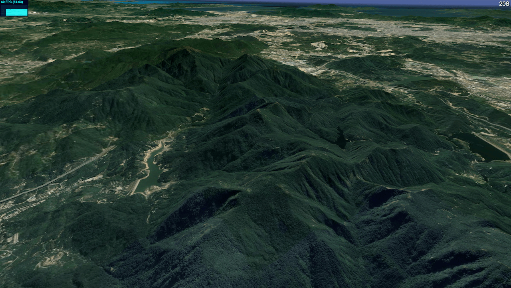

# SATELLITE MAP



[Demo](https://xianziljl.github.io/three-satellite-map/example/) | [API](https://xianziljl.github.io/three-satellite-map/doc/)

## 基本使用
```ts
const planProvider = new PlaneProvider();
planProvider.coordType = UTM;

const mapProvider = new MapProvider();
mapProvider.source = 'https://mts2.google.com/vt/lyrs=s&hl=zh-CN&x=[x]&y=[y]&z=[z]';
mapProvider.debug = true;
mapProvider.useWorker = true;

const meshProvider = new MeshProvider(planProvider, mapProvider);
meshProvider.showBoundingBox = false;

const map = new Map();
map.provider = meshProvider;

map.bbox = [104.955976,20.149765, 120.998419,30.528687];
map.maxZoom = 20;
map.camera = camera;
scene.add(map);


function animate() {
    // ...other updates.
    map.update();
}

```
